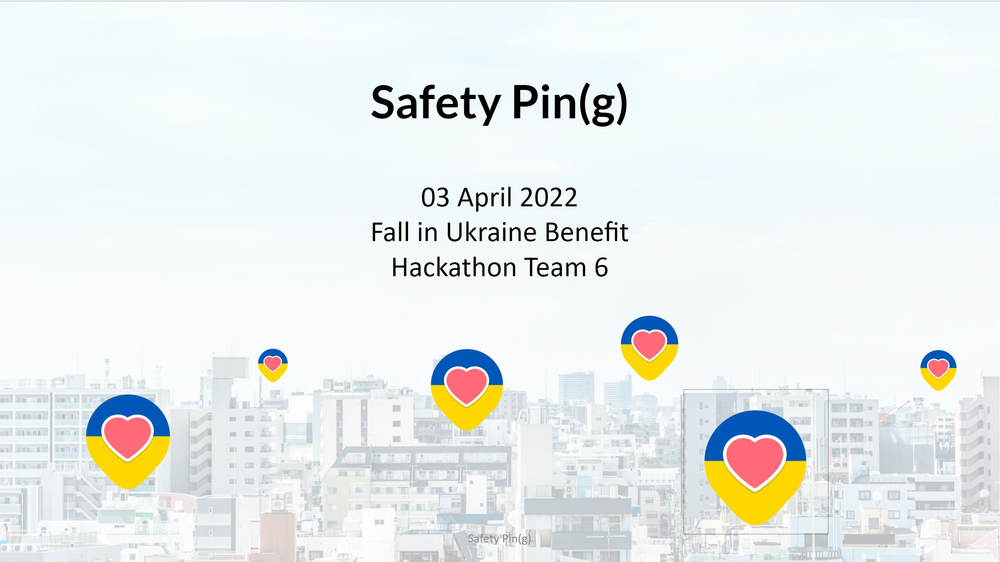

# Safety Pin(g)
## pinging loved ones during times of emergency
### Overview
The ongoing conflict in Ukraine has highlighted the need for a simple, secure way to communicate with friends and family. Safety Pin(g) aims to solve this issue by providing a way for users to check in with their loved ones and ensure they are safe. Users are able to check in with their personal network at customizable intervals. Users can also see time- and location-stamped check-ins from members within their network and receive notifications if someone has missed a check-in. Users can log in with their email and add their connections to groups so they can check in with multiple people at the same time.

:ukraine:**The US military community admires the strength and resiliency of the Ukrainian people.**:ukraine:

### Features
Privacy: Safety Pin(g) will never store a user’s exact location, only the coordinates of the actual city in which the member is located.

Check in regularly so that everyone within your network knows that you are safe.
[Insert image here]

View the timestamps and map locations of the members in your network.
[Insert image here]

Invite others to join your network.
[Insert image here]

### Technologies Utilized
* [SvelteKit](https://svelte.dev/)
* [Vercel](https://vercel.com/)
* [TailwindCSS](https://tailwindcss.com/)
* [Python](https://www.python.org/)
* [Celery](https://docs.celeryq.dev/en/stable/index.html)
* [RabbitMQ](https://www.rabbitmq.com/)
* [Firebase](https://firebase.google.com/)
* [daisyUI](https://daisyui.com/)
* [CloudAMQP](https://www.cloudamqp.com/)
* [Coolors](https://coolors.co/)

### Collaborators
Built during the 2022 Fall In Hackathon by:
* [Brian Donald](https://github.com/0c370t)
* [Ian Tran](https://github.com/idtran)
* [Leeia Isabelle](https://github.com/Leeiaisabelle)
* [Sir David Timothy Wayne, Jr.](https://github.com/Wolverine971)
* [Tejash Desai](https://github.com/Tejash241)
* [Vital Boisset](https://github.com/vital-b)
* [Xiao Grant](https://github.com/XiaoLGrant)

### Licensing
* (licensing info here)
